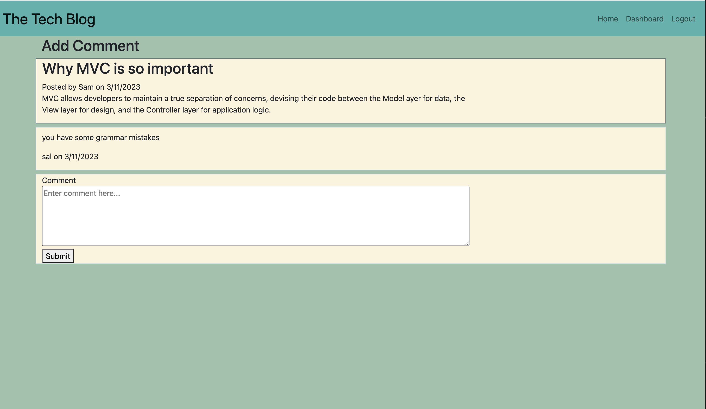

# Tech-Blog

## Description
Tech blog site that allows users to publish articles, blog posts, and edit them and make comments on the posts.  This app follows the MVC paradigm in its architectural structure, using Handlebars.js as the templating language, Sequelize as the ORM, and the express-session npm package for authentication. 


## Table of Contents
* [Links](#links)

* [Installation](#installation)

* [Usage](#usage)

* [License](#license)

* [Code](#code)

* [Tests](#tests)

* [Questions](#questions)

## Links

GitHub URL:  https://github.com/rypab4/employee-tracker
Heroku: https://thetechnologyblog031023.herokuapp.com/

## Installations 

To install necessary dependencies, run the following command if running from github and on local:

```
npm install
    "connect-session-sequelize": "^7.1.5",
    "dotenv": "^16.0.3",
    "express": "^4.18.2",
    "express-handlebars": "^6.0.7",
    "express-session": "^1.17.3",
    "inquirer": "^9.1.4",
    "jest": "^29.4.3",
    "morgan": "^1.10.0",
    "mysql2": "^3.1.0",
    "nodemon": "^2.0.20",
    "sequelize": "^6.28.0"

mysql

```


## Usage
This tool is to connect tech writers and give them a platform to allow them to discuss anything and everything tech.
1. Go to website https://thetechnologyblog031023.herokuapp.com/ .  It may be a blank page if there are no blog posts


2. Click on Login. 


3.  Click on Sign Up. Enter username and password


4.  Once you click on the button Sign Up, you will be brought to your Dashboard.  Here you create a new post or can see your posts and you can edit them. The post will contain your name and the post date


5. To Edit your post click on the title of your post.  Click Update Post when done.


6. Go to Home and click on a title to make comments on a post.  Making comments can only be made on homepage.


## License
    
none


## Code
* HTML/CSS
* JS
* Bootstrap
* Node.js
* Jest
* Inquirer
* fs


## Tests
To run tests, run the follwoing command:
```
npm test
```

## Questions
If you have any questions about the repo, open an issue or contact me directly at rypab4@gmail.com.  You can find my work at https://www.github.com/rypab4.